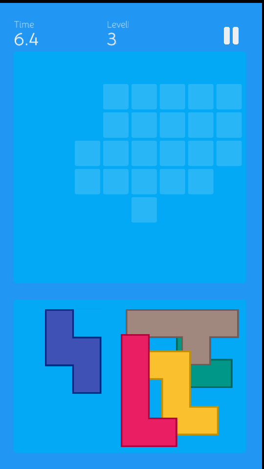
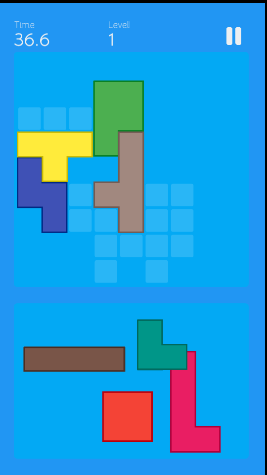

# Ubongo: Mobile puzzle game

A game where you get random pieces, a random board, and then you need to fit all pieces on the board!

|  |  |
|----------------------------------------------------|------------------------------------------------|

## Versioning

As this game is focused on being able to play together, even without an active internet connection, playing on the same
version is important. The app follows x.y.z versioning where:

* x: Major, overhauling the game, likely to always be 0/1.
* y: Minor, gameplay changes, could result in a different board.
* z: Patch, minor changes, or bug fixes, unrelated to gameplay.